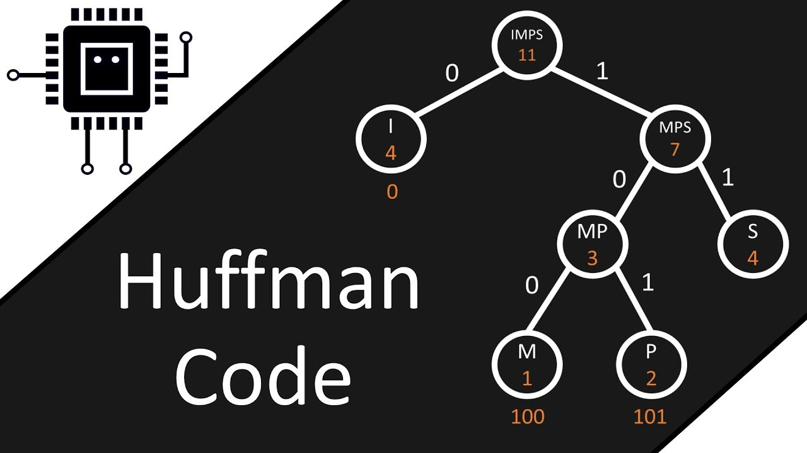

<div align="center">
<br>



</div>


<p align="center">


</p>


<h1 align="center"> C - Huffman coding </h1>


<h3 align="center">
<a href="https://github.com/RazikaBengana/holbertonschool-system_algorithms/tree/main/huffman_coding#eye-about">About</a> •
<a href="https://github.com/RazikaBengana/holbertonschool-system_algorithms/tree/main/huffman_coding#hammer_and_wrench-tasks">Tasks</a> •
<a href="https://github.com/RazikaBengana/holbertonschool-system_algorithms/tree/main/huffman_coding#memo-learning-objectives">Learning Objectives</a> •
<a href="https://github.com/RazikaBengana/holbertonschool-system_algorithms/tree/main/huffman_coding#computer-requirements">Requirements</a> •
<a href="https://github.com/RazikaBengana/holbertonschool-system_algorithms/tree/main/huffman_coding#keyboard-more-info">More Info</a> •
<a href="https://github.com/RazikaBengana/holbertonschool-system_algorithms/tree/main/huffman_coding#mag_right-resources">Resources</a> •
<a href="https://github.com/RazikaBengana/holbertonschool-system_algorithms/tree/main/huffman_coding#bust_in_silhouette-authors">Authors</a> •
<a href="https://github.com/RazikaBengana/holbertonschool-system_algorithms/tree/main/huffman_coding#octocat-license">License</a>
</h3>

---

<!-- ------------------------------------------------------------------------------------------------- -->

<br>
<br>

## :eye: About

<br>

<div align="center">

**`C - Huffman coding`** project focuses on implementing a complete data compression algorithm using `Huffman coding` techniques in the `C` programming language.
<br>
The programs cover various aspects of the Huffman coding process, including creating and managing **binary trees** and **heaps**, building **priority queues**, constructing **Huffman trees**, and generating **Huffman codes** based on character frequencies.
<br>
<br>
This project has been created by **[Holberton School](https://www.holbertonschool.com/about-holberton)** to enable every student to understand how **lossless data compression algorithms** in C language work.

</div>

<br>
<br>

<!-- ------------------------------------------------------------------------------------------------- -->

## :hammer_and_wrench: Tasks

<br>

**`0. Min Binary Heap - Create heap`**

**`1. Min Binary Heap - Create node`**

**`2. Min Binary Heap - Insert node`**

**`3. Min Binary Heap - Extract`**

**`4. Min Binary Heap - Delete heap`**

**`5. Symbols: Create symbol`**

**`6. Huffman coding - Step 1: Priority queue`**

**`7. Huffman coding - Step 2: Extract`**

**`8. Huffman coding - Step 3: Build Huffman tree`**

**`9. Huffman coding - Step 4: Huffman codes`**

**`10. Huffman - Compression & Decompression`**

<br>
<br>

<!-- ------------------------------------------------------------------------------------------------- -->

## :memo: Learning Objectives

<br>

**_You are expected to be able to [explain to anyone](https://fs.blog/feynman-learning-technique/), without the help of Google:_**

<br>

```diff

General

+ What is a binary Heap (min and max)

+ What is a priority queue

+ What is a Huffman code

```

<br>
<br>

<!-- ------------------------------------------------------------------------------------------------- -->

## :computer: Requirements

<br>

```diff

General

+ Allowed editors: vi, vim, emacs

+ All your files will be compiled on Ubuntu 20.04 LTS

+ Your programs and functions will be compiled with gcc 9.4.0 using the flags -Wall -Werror -Wextra and -pedantic

+ All your files should end with a new line

+ A README.md file, at the root of the folder of the project, is mandatory

+ Your code should use the Betty style. It will be checked using betty-style.pl and betty-doc.pl

- You are not allowed to use global variables

+ No more than 5 functions per file

+ You are allowed to use the standard library

+ In the following examples, the main.c files are shown as examples. You can use them to test your functions, but you don’t have to push them to your repo (if you do we won’t take them into account). We will use our own main.c files at compilation. Our main.c files might be different from the one shown in the examples

+ The prototypes of all your functions should be included in your header files called huffman.h and heap/heap.h

+ Don’t forget to push your header files

+ All your header files should be include guarded

```

<br>

**_Why all your files should end with a new line? See [HERE](https://unix.stackexchange.com/questions/18743/whats-the-point-in-adding-a-new-line-to-the-end-of-a-file/18789)_**

<br>
<br>

<!-- ------------------------------------------------------------------------------------------------- -->

## :keyboard: More Info

<br>

### Data structures:

<br>

- Please use the following data structures and types for this project. <br>
  Don’t forget to include them in your header file(s). <br>
  You’ll have to declare the following data structures in your header file `heap.h` in the folder `huffman_coding/heap`:

<br>

```c
/**
 * struct binary_tree_node_s - Binary tree node data structure
 *
 * @data: Data stored in a node
 * @left: Pointer to the left child
 * @right: Pointer to the right child
 * @parent: Pointer to the parent node
 */
    
typedef struct binary_tree_node_s
{
    void *data;
    struct binary_tree_node_s *left;
    struct binary_tree_node_s *right;
    struct binary_tree_node_s *parent;
} binary_tree_node_t;

/**
 * struct heap_s - Heap data structure
 *
 * @size: Size of the heap (number of nodes)
 * @data_cmp: Function to compare two nodes data
 * @root: Pointer to the root node of the heap
 */
    
typedef struct heap_s
{
    size_t size;
    int (*data_cmp)(void *, void *);
    binary_tree_node_t *root;
} heap_t;
```

<br>
<br>

- You’ll have to declare the following data structures in your header file `huffman.h` in the folder `huffman_coding`:

<br>

```c
/**
 * struct symbol_s - Stores a char and its associated frequency
 *
 * @data: The character
 * @freq: The associated frequency
 */
 
typedef struct symbol_s
{
    char data;
    size_t freq;
} symbol_t;
```

<br>
<br>

### Print function:

<br>

- To match the examples in the tasks, you are given [these functions](https://github.com/hs-hq/0x1e.c).

    - Theses functions are used only for visualisation purpose. <br>
      You don’t have to push them to your repo. <br>
      They may not be used during the correction.

<br>
<br>

<!-- ------------------------------------------------------------------------------------------------- -->

## :mag_right: Resources

<br>

**_Do you need some help?_**

<br>

**Read or watch:**

* [Binary Heap](https://en.wikipedia.org/wiki/Binary_heap)

* [Huffman coding](https://en.wikipedia.org/wiki/Huffman_coding)

* [Enumerated Types](https://users.cs.utah.edu/~germain/PPS/Topics/C_Language/enumerated_types.html)

* [Huffman Coding and Huffman Trees](https://www.youtube.com/watch?v=JsTptu56GM8)

<br>
<br>

<!-- ------------------------------------------------------------------------------------------------- -->

## :bust_in_silhouette: Authors

<br>


<br>
<br>

<!-- ------------------------------------------------------------------------------------------------- -->

## :octocat: License

<br>

```C - Huffman coding``` _project has no license specified._

<br>
<br>

---

<p align="center"><br>2023</p>