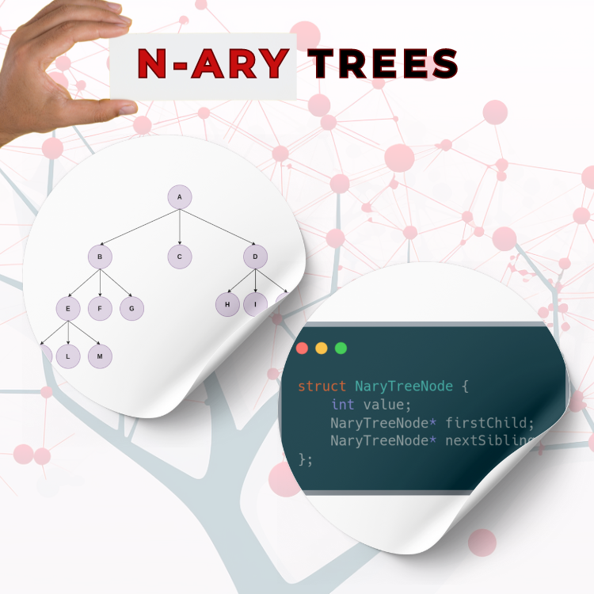

<div align="center">
<br>



</div>


<p align="center">


</p>


<h1 align="center"> C - N-ary trees </h1>


<h3 align="center">
<a href="https://github.com/RazikaBengana/holbertonschool-system_algorithms/tree/main/nary_trees#eye-about">About</a> •
<a href="https://github.com/RazikaBengana/holbertonschool-system_algorithms/tree/main/nary_trees#hammer_and_wrench-tasks">Tasks</a> •
<a href="https://github.com/RazikaBengana/holbertonschool-system_algorithms/tree/main/nary_trees#memo-learning-objectives">Learning Objectives</a> •
<a href="https://github.com/RazikaBengana/holbertonschool-system_algorithms/tree/main/nary_trees#computer-requirements">Requirements</a> •
<a href="https://github.com/RazikaBengana/holbertonschool-system_algorithms/tree/main/nary_trees#keyboard-more-info">More Info</a> •
<a href="https://github.com/RazikaBengana/holbertonschool-system_algorithms/tree/main/nary_trees#mag_right-resources">Resources</a> •
<a href="https://github.com/RazikaBengana/holbertonschool-system_algorithms/tree/main/nary_trees#bust_in_silhouette-authors">Authors</a> •
<a href="https://github.com/RazikaBengana/holbertonschool-system_algorithms/tree/main/nary_trees#octocat-license">License</a>
</h3>

---

<!-- ------------------------------------------------------------------------------------------------- -->

<br>
<br>

## :eye: About

<br>

<div align="center">

**`C - N-ary trees`** project dives into the implementation and manipulation of tree data structures where each node can have multiple children in the `C` programming language.
<br>
The programs cover essential operations such as creating and inserting nodes, deleting entire trees, performing depth-first traversals, calculating tree diameters, and checking for specific paths within the tree structure.
<br>
<br>
This project has been created by **[Holberton School](https://www.holbertonschool.com/about-holberton)** to enable every student to understand how **tree data structures** in C language work.

</div>

<br>
<br>

<!-- ------------------------------------------------------------------------------------------------- -->

## :hammer_and_wrench: Tasks

<br>

**`0. Insert`**

**`1. Delete`**

**`2. Traversal`**

**`3. Diameter`**

**`4. Path exists`**

<br>
<br>

<!-- ------------------------------------------------------------------------------------------------- -->

## :memo: Learning objectives

<br>

**_You are expected to be able to [explain to anyone](https://fs.blog/feynman-learning-technique/), without the help of Google:_**

<br>

```diff

General

+ What is a N-ary tree

+ What are the most common usage of N-ary trees

+ How to represent an N-ary tree in C in at least two different ways

+ What is the diameter of an N-ary tree

```

<br>
<br>

<!-- ------------------------------------------------------------------------------------------------- -->

## :computer: Requirements

<br>

```diff

General

+ Allowed editors: vi, vim, emacs

+ All your files will be compiled on Ubuntu 20.04 LTS

+ Your programs and functions will be compiled with gcc 9.4.0 using the flags -Wall -Werror -Wextra and -pedantic

+ All your files should end with a new line

+ A README.md file, at the root of the folder of the project, is mandatory

+ Your code should use the Betty style. It will be checked using betty-style.pl and betty-doc.pl

- You are not allowed to use global variables

+ No more than 5 functions per file

+ You are allowed to use the standard library

+ In the following examples, the main.c files are shown as examples. You can use them to test your functions, but you don’t have to push them to your repo (if you do we won’t take them into account). We will use our own main.c files at compilation. Our main.c files might be different from the one shown in the examples

+ The prototypes of all your functions should be included in your header file called nary_trees.h

+ Don’t forget to push your header file

+ All your header files should be include guarded

```

<br>

**_Why all your files should end with a new line? See [HERE](https://unix.stackexchange.com/questions/18743/whats-the-point-in-adding-a-new-line-to-the-end-of-a-file/18789)_**

<br>
<br>

<!-- ------------------------------------------------------------------------------------------------- -->

## :keyboard: More Info

<br>

### Data structures

<br>

- Please use the following data structures and types for this project. <br>
  Don’t forget to include them in your header file:

<br>

```yaml
/**
 * struct nary_tree_s - N-ary tree node structure
 *
 * @content: Content of the node
 * @parent: Pointer to the parent node
 * @nb_children: Number of children
 * @children: Pointer to the head node of the children linked list
 * @next: Pointer to the next child in the parent's children linked list
 */

typedef struct nary_tree_s
{
    char            *content;
    struct nary_tree_s  *parent;
    size_t          nb_children;
    struct nary_tree_s  *children;
    struct nary_tree_s  *next;
} nary_tree_t;
```

<br>
<br>

<!-- ------------------------------------------------------------------------------------------------- -->

## :mag_right: Resources

<br>

**_Do you need some help?_**

<br>

**Read or watch:**

* [K-ary trees](https://en.wikipedia.org/wiki/K-ary_tree)

* [N-ary trees in C](https://blog.mozilla.org/nnethercote/2012/03/07/n-ary-trees-in-c/)

<br>
<br>

<!-- ------------------------------------------------------------------------------------------------- -->

## :bust_in_silhouette: Authors

<br>

**${\color{blue}Razika \space Bengana}$**

<br>
<br>

<!-- ------------------------------------------------------------------------------------------------- -->

## :octocat: License

<br>

```C - N-ary trees``` _project has no license specified._

<br>
<br>

---

<p align="center"><br>2023</p>