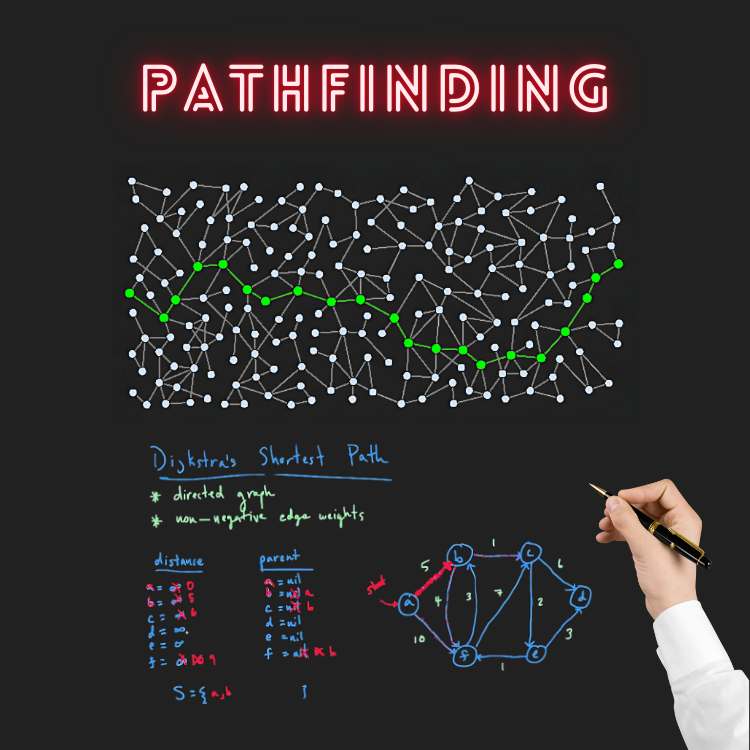

<div align="center">
<br>



</div>


<p align="center">


</p>


<h1 align="center"> C - Pathfinding </h1>


<h3 align="center">
<a href="https://github.com/RazikaBengana/holbertonschool-system_algorithms/tree/main/pathfinding#eye-about">About</a> •
<a href="https://github.com/RazikaBengana/holbertonschool-system_algorithms/tree/main/pathfinding#hammer_and_wrench-tasks">Tasks</a> •
<a href="https://github.com/RazikaBengana/holbertonschool-system_algorithms/tree/main/pathfinding#memo-learning-objectives">Learning Objectives</a> •
<a href="https://github.com/RazikaBengana/holbertonschool-system_algorithms/tree/main/pathfinding#computer-requirements">Requirements</a> •
<a href="https://github.com/RazikaBengana/holbertonschool-system_algorithms/tree/main/pathfinding#keyboard-more-info">More Info</a> •
<a href="https://github.com/RazikaBengana/holbertonschool-system_algorithms/tree/main/pathfinding#mag_right-resources">Resources</a> •
<a href="https://github.com/RazikaBengana/holbertonschool-system_algorithms/tree/main/pathfinding#bust_in_silhouette-authors">Authors</a> •
<a href="https://github.com/RazikaBengana/holbertonschool-system_algorithms/tree/main/pathfinding#octocat-license">License</a>
</h3>

---

<!-- ------------------------------------------------------------------------------------------------- -->

<br>
<br>

## :eye: About

<br>

<div align="center">

**`C - pathfinding`** project is focused on implementing algorithms to find optimal paths within graphs using techniques like `backtracking` and `Dijkstra's algorithm`.
<br>
The programs demonstrate how various pathfinding algorithms can be applied to arrays and graph structures, with supporting libraries for `graph` and `queue` handling.
<br>
<br>
This project has been created by **[Holberton School](https://www.holbertonschool.com/about-holberton)** to enable every student to understand how `graph traversal algorithms` in C language work.

</div>

<br>
<br>

<!-- ------------------------------------------------------------------------------------------------- -->

## :hammer_and_wrench: Tasks

<br>

**`0. Backtracking - Array`**

**`1. Backtracking - Graph`**

**`2. Dijkstra's - Graph`**

**`3. A* - Graph`**

<br>
<br>

<!-- ------------------------------------------------------------------------------------------------- -->

## :memo: Learning Objectives

<br>

**_You are expected to be able to [explain to anyone](https://fs.blog/feynman-learning-technique/), without the help of Google:_**

<br>

```diff

General

+ What is pathfinding

+ What are the most common applications of pathfinding

+ What is backtracking, and why you should never use it

+ What is Dijkstra’s algorithm, and what is its main weakness

+ What is A star algorithm, and how it is better than Dijkstra’s

```

<br>
<br>

<!-- ------------------------------------------------------------------------------------------------- -->

## :computer: Requirements

<br>

```diff

General

+ Allowed editors: vi, vim, emacs

+ All your files will be compiled on Ubuntu 20.04 LTS

+ Your programs and functions will be compiled with gcc 9.4.0 using the flags -Wall -Werror -Wextra and -pedantic

+ All your files should end with a new line

+ A README.md file, at the root of the folder of the project, is mandatory

+ Your code should use the Betty style. It will be checked using betty-style.pl and betty-doc.pl

- You are not allowed to use global variables

+ No more than 5 functions per file

+ You are allowed to use the standard library

+ In the following examples, the main.c files are shown as examples. You can use them to test your functions, but you don’t have to push them to your repo (if you do we won’t take them into account). We will use our own main.c files at compilation. Our main.c files might be different from the one shown in the examples

+ The prototypes of all your functions should be included in your header file called pathfinding.h

+ Don’t forget to push your header file

+ All your header files should be include guarded

```

<br>

**_Why all your files should end with a new line? See [HERE](https://unix.stackexchange.com/questions/18743/whats-the-point-in-adding-a-new-line-to-the-end-of-a-file/18789)_**

<br>
<br>

<!-- ------------------------------------------------------------------------------------------------- -->

## :keyboard: More Info

<br>

### Data structures:

<br>

- Please use the following data structures and types for `binary trees`. <br>
  Don’t forget to include them in your header file `pathfinding.h`:

<br>

```c
/**
 * struct point_s - Structure storing coordinates
 *
 * @x: X coordinate
 * @y: Y coordinate
 */

typedef struct point_s
{
    int x;
    int y;
} point_t;
```

<br>
<br>

### Libraries:

<br>

- For this project, you are given two libraries, containing utility functions to manipulate `graphs` and `queues`.

    - [You can find these libraries here](https://github.com/hs-hq/0x07-pathfinding.c).

- This repository will be used during the auto-review, thus your code will be compiled using `-lgraphs` and `-lqueues`.

<br>
<br>

<!-- ------------------------------------------------------------------------------------------------- -->

## :mag_right: Resources

<br>

**_Do you need some help?_**

<br>

**Read or watch:**

* [Pathfinding](https://en.wikipedia.org/wiki/Pathfinding)

* [Backtracking](https://en.wikibooks.o%20you%20can%20find%20these%20libraries%20here.rg/wiki/Algorithms/Backtracking)

* [Dijkstra’s Algorithm](https://en.wikipedia.org/wiki/Dijkstra%27s_algorithm)

* [Dijkstra’s Algorithm - Computerphile](https://www.youtube.com/watch?v=GazC3A4OQTE)

* [A Star algorithm](https://en.wikipedia.org/wiki/A*_search_algorithm)

* [A Star Search Algorithm - Computerphile](https://www.youtube.com/watch?v=ySN5Wnu88nE)

<br>
<br>

<!-- ------------------------------------------------------------------------------------------------- -->

## :bust_in_silhouette: Authors

<br>


<br>
<br>

<!-- ------------------------------------------------------------------------------------------------- -->

## :octocat: License

<br>

```C - pathfinding``` _project has no license specified._

<br>
<br>

---

<p align="center"><br>2023</p>