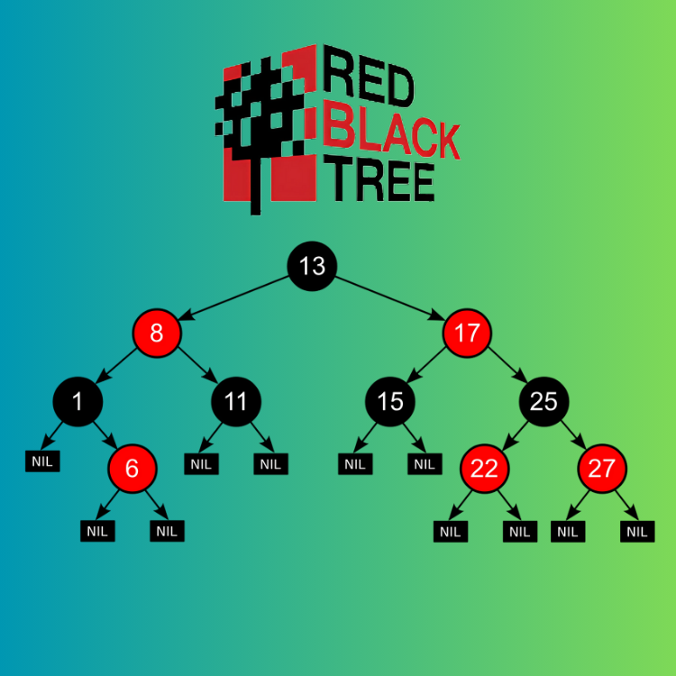

<div align="center">
<br>



</div>


<p align="center">


</p>


<h1 align="center"> C - Red-Black trees </h1>


<h3 align="center">
<a href="https://github.com/RazikaBengana/holbertonschool-system_algorithms/tree/main/red_black_tree#eye-about">About</a> •
<a href="https://github.com/RazikaBengana/holbertonschool-system_algorithms/tree/main/red_black_tree#hammer_and_wrench-tasks">Tasks</a> •
<a href="https://github.com/RazikaBengana/holbertonschool-system_algorithms/tree/main/red_black_tree#memo-learning-objectives">Learning Objectives</a> •
<a href="https://github.com/RazikaBengana/holbertonschool-system_algorithms/tree/main/red_black_tree#computer-requirements">Requirements</a> •
<a href="https://github.com/RazikaBengana/holbertonschool-system_algorithms/tree/main/red_black_tree#keyboard-more-info">More Info</a> •
<a href="https://github.com/RazikaBengana/holbertonschool-system_algorithms/tree/main/red_black_tree#mag_right-resources">Resources</a> •
<a href="https://github.com/RazikaBengana/holbertonschool-system_algorithms/tree/main/red_black_tree#bust_in_silhouette-authors">Authors</a> •
<a href="https://github.com/RazikaBengana/holbertonschool-system_algorithms/tree/main/red_black_tree#octocat-license">License</a>
</h3>

---

<!-- ------------------------------------------------------------------------------------------------- -->

<br>
<br>

## :eye: About

<br>

<div align="center">

**`C - Red-Black trees`** project implements various operations and algorithms related to `Red-Black tree` data structures.
<br>
The programs include functions for **insertion**, **deletion**, **rotation**, and **balancing** of `Red-Black trees`, as well as utility functions for creating and manipulating **tree nodes**.
<br>
<br>
This project has been created by **[Holberton School](https://www.holbertonschool.com/about-holberton)** to enable every student to understand how `self-balancing binary search trees` in C language work.

</div>

<br>
<br>

<!-- ------------------------------------------------------------------------------------------------- -->

## :hammer_and_wrench: Tasks

<br>

**`0. Red-Black - New node`**

**`1. Red-Black - Is Red-Black`**

**`2. Red-Black - Insert`**

**`3. Red-Black - Array to R-B Tree`**

**`4. Red-Black - Remove`**

**`5. Big O #Red-Black Tree`**

<br>
<br>

<!-- ------------------------------------------------------------------------------------------------- -->

## :memo: Learning Objectives

<br>

**_You are expected to be able to [explain to anyone](https://fs.blog/feynman-learning-technique/), without the help of Google:_**

<br>

```diff

General

+ What is a Red Black Tree

```

<br>
<br>

<!-- ------------------------------------------------------------------------------------------------- -->

## :computer: Requirements

<br>

```diff

General

+ Allowed editors: vi, vim, emacs

+ All your files will be compiled on Ubuntu 20.04 LTS

+ Your programs and functions will be compiled with gcc 9.4.0 using the flags -Wall -Werror -Wextra and -pedantic

+ All your files should end with a new line

+ A README.md file, at the root of the folder of the project, is mandatory

+ Your code should use the Betty style. It will be checked using betty-style.pl and betty-doc.pl

- You are not allowed to use global variables

+ No more than 5 functions per file

+ You are allowed to use the standard library

+ In the following examples, the main.c files are shown as examples. You can use them to test your functions, but you don’t have to push them to your repo (if you do we won’t take them into account). We will use our own main.c files at compilation. Our main.c files might be different from the one shown in the examples

+ The prototypes of all your functions should be included in your header files called rb_trees.h

+ Don’t forget to push your header files

+ All your header files should be include guarded

```

<br>

**_Why all your files should end with a new line? See [HERE](https://unix.stackexchange.com/questions/18743/whats-the-point-in-adding-a-new-line-to-the-end-of-a-file/18789)_**

<br>
<br>

<!-- ------------------------------------------------------------------------------------------------- -->

## :keyboard: More Info

<br>

### Data structures:

<br>

- Please use the following data structures and types for this project. <br>
  Don’t forget to include them in your header file(s).

- You’ll have to declare the following data structures in your header file `rb_trees.h` in the folder `red_black_tree`:

<br>

```c
/**
 * enum rb_color_e - Possible color of a Red-Black tree
 *
 * @RED: 0 -> Red node
 * @BLACK: 1 -> Black node
 */
    
typedef enum rb_color_e
{
    RED = 0,
    BLACK,
    DOUBLE_BLACK
} rb_color_t;

/**
 * struct rb_tree_s - Red-Black tree node structure
 *
 * @n: Integer stored in the node
 * @parent: Pointer to the parent node
 * @left: Pointer to the left child node
 * @right: Pointer to the right child node
 * @color: Color of the node (RED or BLACK)
 */
    
typedef struct rb_tree_s
{
    int n;
    rb_color_t color;
    struct rb_tree_s *parent;
    struct rb_tree_s *left;
    struct rb_tree_s *right;
} rb_tree_t;
```

<br>
<br>

### Print function:

<br>

- To match the examples in the tasks, you are given [these functions](https://github.com/hs-hq/0x1E.c).

    - These functions are used only for visualisation purposes. <br>
      You don’t have to push them to your repo. <br>
      They may not be used during the correction.

<br>
<br>

<!-- ------------------------------------------------------------------------------------------------- -->

## :mag_right: Resources

<br>

**_Do you need some help?_**

<br>

**Read or watch:**

* [Red Black tree](https://en.wikipedia.org/wiki/Red%E2%80%93black_tree)

<br>
<br>

<!-- ------------------------------------------------------------------------------------------------- -->

## :bust_in_silhouette: Authors

<br>


<br>
<br>

<!-- ------------------------------------------------------------------------------------------------- -->

## :octocat: License

<br>

```C - Red-Black trees``` _project has no license specified._

<br>
<br>

---

<p align="center"><br>2023</p>